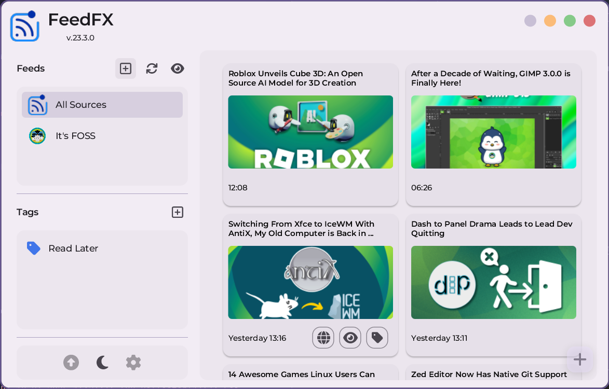
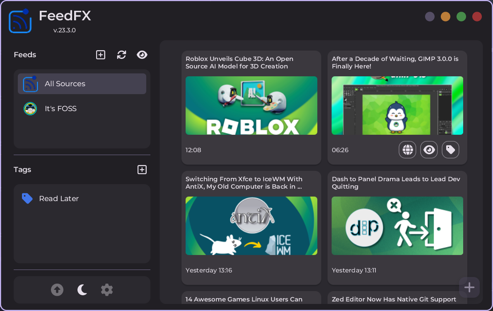
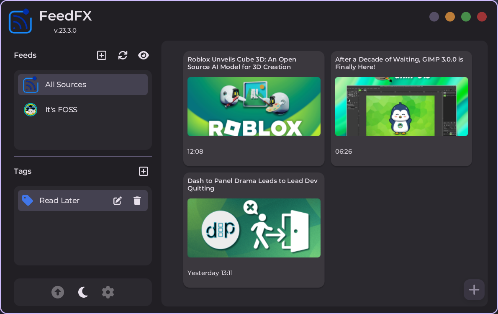

<p align="center">
  
</p>

<p align="center">
  
  
  
  
</p>

<div align="center">
    <h2>📖 Description</h2>
</div>

FeedFX is a desktop application built with **Java** and **JavaFX** that allows users to read and store **RSS feeds**
from multiple sources. A key feature of FeedFX is its ability to categorize feeds using **tags**, making it easy to
filter and organize content based on user preferences.

<div align="center">
    <h2>🚀 Features</h2>
</div>


- Subscribe to multiple **RSS sources**
- Store and organize feeds with **custom tags**
- Filter feeds based on selected sources and tags
- **Cross-platform support**
- In-app update notifier

<div align="center">
    <h2>📥 Installation</h2>
</div>

Installers for FeedFX are available on the **GitHub Releases** page, supported platforms:  
✅ **Windows** (MSI Installer available)  
✅ **Linux** (Packages: `.deb`, `.rpm`)  
✅ **All Platforms** (other systems can run the app through the provided fat-jar)
 
<div align="center">
    <h2>🛠 Usage</h2>
</div>

### Using an Installer

1. Download the appropriate installer from the [Releases](https://github.com/palexdev/FeedFX/releases/latest) page.
2. Install the application.
3. Launch FeedFX and start managing your RSS feeds.

### Using the Fat JAR

1. Download the `fat-jar` from the [Releases](https://github.com/palexdev/FeedFX/releases/latest) page.
2. Open a terminal and run:
   ```sh
   java -jar <jar-name>.jar
   ```
3. The application will launch and be ready for use.

<div align="center">
    <h2>🏗 Technologies Used</h2>
</div>

- **Java**
- **JavaFX** for the UI
- **SQLite** for managing and storing feeds locally

## 📷 Screenshots

|  |  |  |
|----------------------------------|----------------------------------|----------------------------------|

---

💡 **Contributions & Issues**: Feel free to contribute or report any issues by opening
an [issue](https://github.com/palexdev/FeedFX/issues) on GitHub!

📧 **Contact**: [Discussions](https://github.com/palexdev/FeedFX/discussions) or via [mail](mailto:alessandro.parisi406@gmail.com)

🚀 Happy Feeds! 🎉

